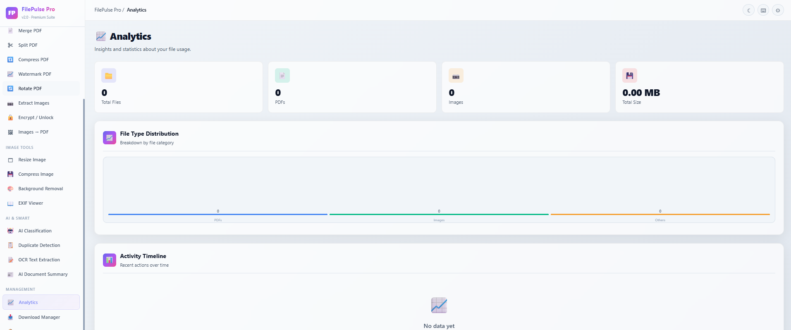
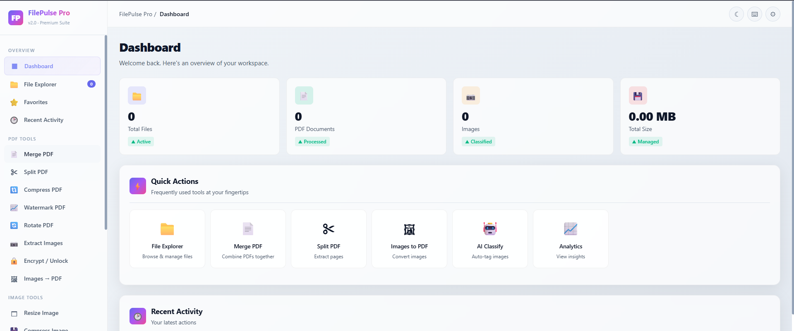
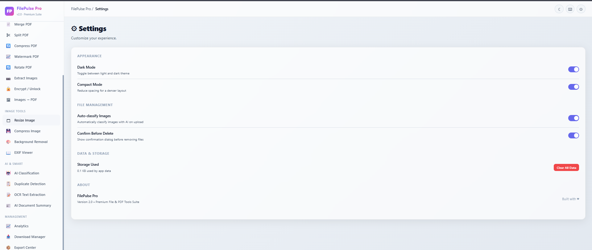
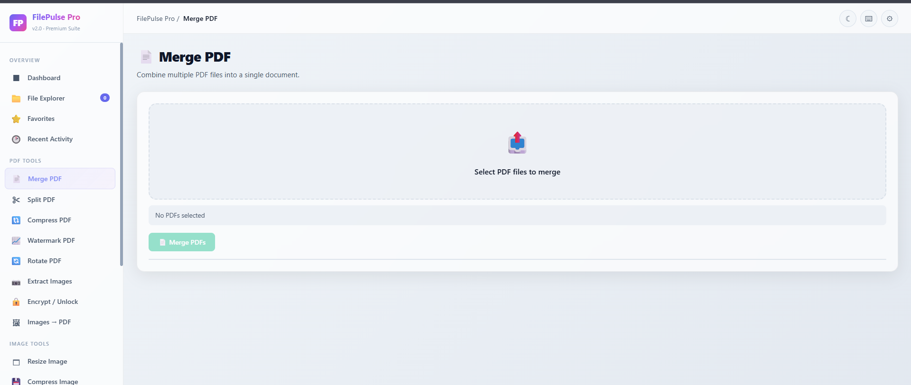

# 🚀 FilePulse Pro

<div align="center">



# 📁 FilePulse Pro

### Modern File Explorer & PDF Productivity Suite

A powerful browser-based File Management and PDF Utility application built entirely with **HTML, CSS, and JavaScript**. FilePulse Pro combines professional file management, advanced PDF processing, AI-powered image classification, analytics, and productivity tools into one modern and responsive web application.

⚡ **100% Client Side** • 🔒 **Privacy First** • 📄 **PDF Toolkit** • 🤖 **AI Powered**

---


</div>

---

# 🌐 Live Demo

> **GitHub Pages**

https://YOUR_GITHUB_USERNAME.github.io/FilePulse-Pro/

---

# 📸 Application Preview

## Dashboard



---

## File Explorer



---

## PDF Tools



---

# 📖 About the Project

FilePulse Pro is a browser-based productivity application that provides a complete suite of file management and PDF processing tools.

Unlike traditional desktop software, all operations are performed **directly inside the browser**, ensuring complete privacy since no files are uploaded to any external server.

The project focuses on providing a clean, modern, responsive, and professional interface inspired by desktop applications such as Windows File Explorer and Adobe Acrobat.

---

# ✨ Features

## 📁 File Explorer

- Modern File Explorer
- Drag & Drop Upload
- List View
- Grid View
- File Preview
- Search Files
- Sort Files
- Favorite Files
- Recent Activity
- Bulk Selection
- ZIP Download
- Responsive Interface

---

## 📄 PDF Tools

- Merge PDF Files
- Split PDF Pages
- Compress PDF
- Rotate PDF
- Watermark PDF
- Encrypt PDF
- Unlock PDF
- Extract Images
- Images to PDF Conversion
- Batch Processing

---

## 🖼 Image Tools

- Image Preview
- Image Compression
- Image Resize
- Gallery View
- Background Removal *(Planned)*
- EXIF Viewer *(Planned)*

---

## 🤖 AI Features

Powered by **TensorFlow.js** and **MobileNet**

- AI Image Classification
- Automatic Image Labeling
- Confidence Score Display
- Local Machine Learning Inference
- Smart File Recognition
- Duplicate Detection *(Future)*

---

## 📊 Dashboard

- Overview Statistics
- Total Files
- PDF Count
- Image Count
- Storage Usage
- Recent Activity
- Quick Actions

---

## 🎨 Modern UI

- Glassmorphism Design
- Responsive Layout
- Sidebar Navigation
- Dashboard
- Dark Mode
- Light Mode
- Context Menu
- Toast Notifications
- Keyboard Shortcuts
- Animated Components
- Modern Cards
- Accessibility Support

---

# 🛠 Technologies Used

- HTML5
- CSS3
- JavaScript (ES6)
- TensorFlow.js
- MobileNet
- PDF-Lib
- jsPDF
- JSZip
- FileSaver.js
- Local Storage API

---

# 📂 Folder Structure

```
FilePulse-Pro
│
├── assets
│   └── images
│       ├── dashboard.png
│       ├── explorer.png
│       ├── pdf-tools.png
│       └── screenshot.png
│
├── index.html
├── LICENSE
└── README.md
```

---

# 🚀 Getting Started

Clone the repository

```bash
git clone https://github.com/YOUR_GITHUB_USERNAME/FilePulse-Pro.git
```

Open

```
index.html
```

using any modern web browser.

No installation required.

No backend required.

No database required.

---

# 💻 Browser Support

- Google Chrome
- Microsoft Edge
- Mozilla Firefox
- Safari
- Opera

---

# 🔒 Privacy

All processing happens locally inside your browser.

✔ No File Uploads

✔ No Cloud Processing

✔ No Data Collection

✔ Complete User Privacy

---

# 📈 Performance

- Fast Client-side Processing
- Lightweight
- Responsive UI
- Browser Optimized
- Offline Friendly
- Zero Server Dependency

---

# 🛣 Roadmap

- OCR Text Extraction

- AI Document Summary

- Duplicate Image Detection

- Background Removal

- PDF to Word

- Word to PDF

- Digital Signature

- PDF Annotation

- Cloud Storage Integration

- Google Drive Support

- Dropbox Integration

- OneDrive Support

- Progressive Web App (PWA)

- Batch Rename

- AI Smart Search

---

# 📸 Screenshots

### Dashboard


---

### File Explorer


---

### PDF Tools


---

# 🤝 Contributing

Contributions, feature requests, and improvements are welcome.

If you would like to improve FilePulse Pro:

1. Fork the repository
2. Create a new branch
3. Commit your changes
4. Push the branch
5. Open a Pull Request

---

# 📄 License

This project is licensed under the **MIT License**.

See the **LICENSE** file for more information.

---

# 👨‍💻 Developer

## **Leela Prasad. Paila**

Frontend Developer | JavaScript Enthusiast | UI/UX Designer

GitHub:
https://github.com/LeelaprasadPaila

---

# ⭐ Support

If you found this project useful,

⭐ Star this repository

🍴 Fork the repository

📢 Share it with others

---

<div align="center">

### Thank you for visiting FilePulse Pro ❤️

Made with HTML • CSS • JavaScript

</div>
